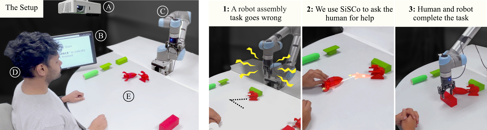

# SiSCo
This repository consist implementation of IROS 2024 submission \" **SiSCo**: **Si**gnal **S**ynthesis for Effective Human-Robot **Co**mmunication via Large Language Models\"


## Abstract
Effective human-robot collaboration hinges on robust communication channels, with visual signaling playing a pivotal role due to its intuitive appeal. Yet, the creation of visually intuitive cues often demands extensive resources and specialized knowledge. The emergence of Large Language Models (LLMs) offers promising avenues for enhancing human-robot interactions and revolutionizing the way we generate context-aware visual cues. To this end, we introduce **SiSCo**--a novel framework that combines the computational prowess of LLMs with mixed-reality technologies to streamline the generation of visual cues for human-robot collaboration. Our results indicate that SiSCo significantly improves the efficiency of communicative exchanges in the human-robot teaming task by approximately 60% compared to baseline natural language signals. Moreover, SiSCo contributes to a 46% reduction in cognitive load for participants on a NASA-TLX subscale, and above-average user ratings for on-the-fly generated signals for unseen objects. To foster broader community engagement and further development, we provide comprehensive access to SiSCo's implementation and related materials at <a href="http://example.com/](https://github.com/ir-lab/SiSCo)" target="_blank">https://github.com/ir-lab/SiSCo</a>. 


## 


**Left:** The physical setup of the teaming task: The robot places objects on the tabletop surface environment. When the robot needs help, it uses SiSCo to present synthesized signals through a projector (A) or a monitor (B) to the human. **Right:** The task procedure during the human-robot teaming task.


## Installation
Basic Requirements <br />
OS: **Ubuntu 20.04** <br />
Python Version: **3.8.10** <br />
ROS Version: **Noetic**


* Create a python virtual environment (venv) e.g. <br />
    ```bash
    $ python3.8 -m venv ~/.sisco && source ~/.sisco/bin/activate
    ```

* Install dependencies in .sisco venv as follows: <br />
    ```note: you will need sudo permissions for PyKDL package installations.```
    ```bash
    $ bash install.sh
    ```

* In order to run SiSCo, in addition to installations, you need to get "openai api key." [click here to get your openai api key](https://platform.openai.com/api-keys) <br />
```note: you need to create openai account in order to get key.```
Once you have your openai api key, setup an environment variable in your bashrc file as follows:
    ```bash
    $ echo "export OPENAI_API_KEY=\"your-openaiapi-key\"" >> ~/.bashrc  && source ~/.bashrc
    ```

##
### Visualize SiSCo outputs

In this paper, a projector-camera-based mixed-reality setup was used. However, you can directly visualize **SiSCo** output on a monitor by providing your custom input values to properties used by the Object Visual Signal Synthesizer (**ObjectVSS**) and Instruction Visual Signal Synthesizer (**InstVSS**):

* Object Description ( &Delta; ): "Rocket"
* Object Color ( &Theta; ): "Red"
* Goal Orientation ( &Pi; ): [500,250]
* Instruction ( &Omega; ): "Insert from right"

Details about ObjectVSS and InstVSS can be found in [core.py](./context/core.py)

Here goal pose is set to the center of image. Run following code and enter creative inputs to see **SiSCo** outputs.
```bash
$ python sisco_vis.py
```

##
### Human Robot Teaming Experiment
This repository contains code used for the Human-Robot Teaming task. You can find the code in [human_robot_teaming_exp.py](./human_robot_teaming_exp.py). Before running the code, ensure you have the UR5 robot ROS controller installed, which you can obtain from the following repository: [https://github.com/ir-lab/irl_robots](https://github.com/ir-lab/irl_robots).

> **Note:** This code interacts with the UR5 robot arm. Please use it only under the supervision of an expert familiar with UR5 robots. Always ensure there is an emergency stop button nearby.

> **Note**: It is recommended to have two monitors while running the following script, as visualizations are shown in full screen by default which might block your terminal access. Press the "**space**" key if you want to remove the visualization. 
#### Running the Code

To run the code, use the following command:

```bash
$ python human_robot_teaming_exp.py
```

To visualize **VSIntPro** with debug_mode 2 or **VSM** with debug_mode 3 options, run the code with the following input arguments. The robot will not move during visualization but it will first go to the home position:

```bash
$ python human_robot_teaming_exp.py --debug 1 --debug_mode [2 or 3]
```


<!-- ## References
* <a name="ref_1"></a> [Projecting Robot Intentions Through Visual Cues: Static vs. Dynamic Signaling](https://arxiv.org/abs/2308.09871)
* <a name="ref_2"></a> [Projecting robot intentions into human environments](https://ieeexplore.ieee.org/abstract/document/7745145)
* <a name="ref_3"></a> [Better Teaming Through Visual Cues: How Projecting Imagery in a Workspace Can Improve Human-Robot Collaboration](https://ieeexplore.ieee.org/abstract/document/8359206) -->